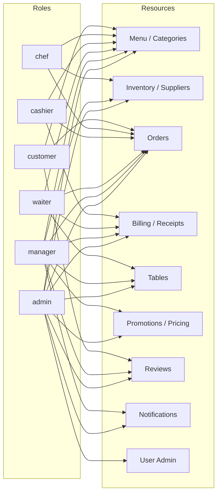

# Role-Based Access Control (RBAC) — Access Graph

This is the canonical reference for **who can do what** in the Restaurant Management System.

- **Source of truth (enforcement):** [`backend_restaurant/config/rbac.ts`](https://github.com/Zardd99/backend_restaurant/blob/main/config/rbac.ts) + the `requirePermission(...)` middleware in [`backend_restaurant/middleware/auth.ts`](https://github.com/Zardd99/backend_restaurant/blob/main/middleware/auth.ts).
- **UI mirror (gating only):** [`restaurant_mangement_system/app/config/rbac.ts`](../app/config/rbac.ts).
- The frontend matrix is for hiding controls/routes a role can't use. **All real authorization happens on the backend.** Keep the two matrices in sync.

## Roles

| Role | Description |
| --- | --- |
| `admin` | Full system access, including staff/user administration. |
| `manager` | All operational areas (menu, inventory, suppliers, orders, billing, promotions, tables) except user administration. |
| `chef` | Kitchen: read menu/inventory, read orders, advance order/prep status. |
| `waiter` | Floor: create/update orders, manage tables, take payment, read menu/receipts. |
| `cashier` | Till: read orders, take payment, read receipts. |
| `customer` | Public: browse menu, place own orders, leave reviews. |

## Role → Resource graph

## Permission matrix (role × permission)

✓ = granted. Blank = denied.

| Permission | admin | manager | chef | waiter | cashier | customer |
| --- | :---: | :---: | :---: | :---: | :---: | :---: |
| `menu:read` | ✓ | ✓ | ✓ | ✓ | ✓ | ✓ |
| `menu:write` | ✓ | ✓ | | | | |
| `category:read` | ✓ | ✓ | ✓ | ✓ | ✓ | ✓ |
| `category:write` | ✓ | ✓ | | | | |
| `inventory:read` | ✓ | ✓ | ✓ | | | |
| `inventory:write` | ✓ | ✓ | | | | |
| `supplier:read` | ✓ | ✓ | | | | |
| `supplier:write` | ✓ | ✓ | | | | |
| `order:read` | ✓ | ✓ | ✓ | ✓ | ✓ | |
| `order:create` | ✓ | ✓ | | ✓ | | ✓ |
| `order:update` | ✓ | ✓ | | ✓ | | |
| `order:delete` | ✓ | ✓ | | | | |
| `order:status` | ✓ | ✓ | ✓ | ✓ | | |
| `billing:read` | ✓ | ✓ | | ✓ | ✓ | |
| `billing:pay` | ✓ | ✓ | | ✓ | ✓ | |
| `receipt:read` | ✓ | ✓ | | ✓ | ✓ | |
| `receipt:list` | ✓ | ✓ | | | | |
| `receipt:write` | ✓ | ✓ | | | | |
| `table:read` | ✓ | ✓ | | ✓ | | |
| `table:manage` | ✓ | ✓ | | ✓ | | |
| `promotion:manage` | ✓ | ✓ | | | | |
| `price:read` | ✓ | ✓ | | | | |
| `review:read` | ✓ | ✓ | | | | |
| `review:write` | ✓ | ✓ | | | | ✓ |
| `notification:read` | ✓ | ✓ | ✓ | ✓ | ✓ | |
| `notification:manage` | ✓ | ✓ | | | | |
| `user:manage` | ✓ | | | | | |

> Note: `inventory:read`/`inventory:write` endpoints that participate in the order lifecycle (`/check-availability`, `/preview`, `/consume`) also accept order-managing roles (waiter/chef) so service flows aren't blocked — see route table.

## Route → required permission

`auth` = requires a valid token. `public` = no auth.

### Auth (`/api/auth`)
| Method | Path | Access |
| --- | --- | --- |
| POST | `/register` | public — **always creates a `customer`** (client role ignored) |
| POST | `/login` | public |
| GET | `/me` | auth |
| PUT | `/update` | auth (self) |
| PUT | `/change-password` | auth (self) |

### Menu (`/api/menu`) & Category (`/api/category`)
| Method | Path | Permission |
| --- | --- | --- |
| GET | `/`, `/:id` | public |
| POST/PUT/DELETE | `/`, `/:id` | `menu:write` |

### Inventory (`/api/inventory`) — all `auth`
| Method | Path | Permission |
| --- | --- | --- |
| POST | `/check-availability`, `/preview` | `inventory:read` ∪ order roles |
| POST | `/consume` | `inventory:write` ∪ order roles |
| GET | `/dashboard`, `/stock-levels`, `/low-stock`, `/stock/:id` | `inventory:read` |
| GET | `/ingredients` | `inventory:read` |
| PUT | `/stock` | `inventory:write` |
| POST | `/reorder`, `/bulk-update`, `/ingredients`, `/ingredients/:id/adjust` | `inventory:write` |
| PUT/DELETE | `/ingredients/:id` | `inventory:write` |

### Suppliers (`/api/supplier`) — all `auth`
| Method | Path | Permission |
| --- | --- | --- |
| GET | `/`, `/:id`, `/:id/*` | `supplier:read` |
| POST/PUT/DELETE | `/`, `/:id` | `supplier:write` |

### Orders (`/api/orders`) — all `auth`
| Method | Path | Permission |
| --- | --- | --- |
| GET | `/`, `/stats`, `/:id` | `order:read` |
| POST | `/` | `order:create` |
| PUT | `/:id` | `order:update` |
| DELETE | `/:id` | `order:delete` |
| PATCH | `/:id/status` | `order:status` |
| POST | `/:id/inventory` | `order:update` |

### Billing (`/api/billing`) & Receipts (`/api/receipts`) — all `auth`
| Method | Path | Permission |
| --- | --- | --- |
| GET | `/billing/served` | `billing:read` |
| PATCH | `/billing/:id/pay` | `billing:pay` |
| GET | `/receipts` | `receipt:list` |
| GET | `/receipts/:id`, `/receipts/order/:id` | `receipt:read` |
| POST/PUT | `/receipts`, `/receipts/:id` | `receipt:write` |

### Tables (`/api/tables`) — all `auth`
| Method | Path | Permission |
| --- | --- | --- |
| GET | all read endpoints | `table:read` |
| POST | `/:tableNumber/release` | `table:manage` |

### Promotions (`/api/promotions`)
| Method | Path | Permission |
| --- | --- | --- |
| GET | `/active` | public |
| GET/POST/PUT/DELETE | others | `promotion:manage` |

### Price history (`/api/priceHistory`) — `auth`, `price:read`

### Reviews (`/api/reviews`)
| Method | Path | Permission |
| --- | --- | --- |
| GET | reads | public |
| POST/PUT | `/`, `/:id` | `review:write` |
| DELETE / `/bulk-delete` | moderation | `review:read` (admin/manager) |

### Notifications (`/api/notifications`) — all `auth`
| Method | Path | Permission |
| --- | --- | --- |
| GET `/`, PATCH `/read` | | `notification:read` |
| DELETE `/` | | `notification:manage` |

### Users (`/api/users`) — all `auth`, `user:manage`
| Method | Path | Notes |
| --- | --- | --- |
| GET | `/`, `/:id` | |
| PUT | `/:id` | refuses to demote/deactivate the last active admin |
| PATCH | `/:id/role` | dedicated role assignment; same last-admin guard |
| DELETE | `/:id` | refuses to delete the last active admin |

### Support (`/api/support`)
| Method | Path | Access |
| --- | --- | --- |
| POST | `/contact` | public (rate-limited) |

## Frontend gating

- The entire `(admin)` route group is wrapped by [`app/(admin)/layout.tsx`](../app/(admin)/layout.tsx) → `ProtectedRoute requiredRoles={["admin","manager"]}`.
- `ProtectedRoute` supports `requiredRole` (legacy), `requiredRoles`, and `requiredPermission`.
- Unauthenticated users are sent to `/login`; authenticated-but-unauthorized users to `/unauthorized`.

## Changing the matrix

1. Edit `ROLE_PERMISSIONS` in **both** `rbac.ts` files (backend = enforcement, frontend = UI).
2. Update this document's matrix + route tables.
3. Re-run `npm run build` (backend) and `npx tsc --noEmit` (frontend).
